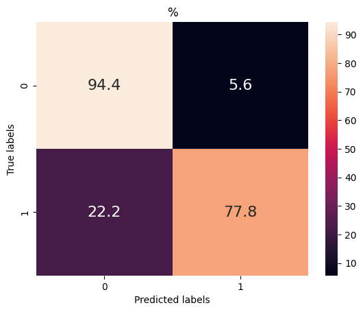
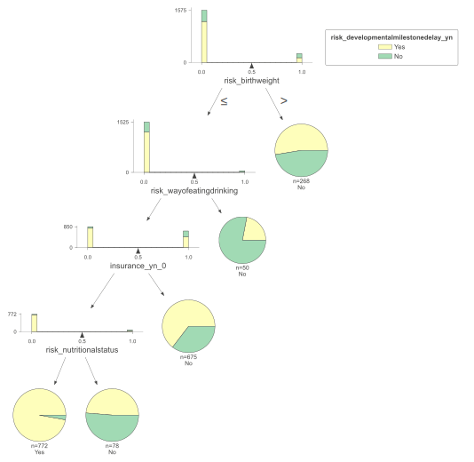
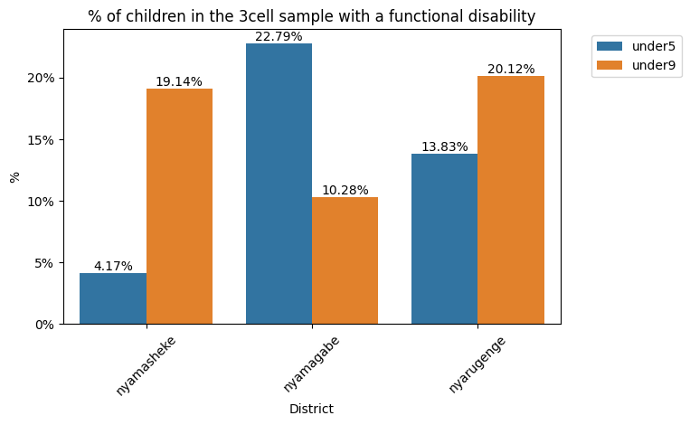

# Rwanda-CwD-Analysis
Analysis of anonymised & de-identified data for children with disabilities and developmental delays in Rwanda

## Data Sources
Data was collected in Rwanda with two sampling methods:
    1. 3 cells (3c): All households  in 3 cells in 3 districts were surveyed.
    2. 22 districts (22d): Parents in 60 sectors were encouraged to self-identify
Two survey tools were used:
    1. For under-3s: A newly designed tool asking about family, birth, child health and social risk factors which could be related to developmental delay
    2. For 3-8 year olds: Washington Group Child Functioning Module Questionnaire was administered

Data was de-identified by removing all names, phone numbers, names of schools, open-input columns and village identifiers.

## Description
This dataset allows us to examine a key question in the detection of disability and developmental delays: what are the most important factors that could be used to efficiently identify and support households of children with disabilities or developmental delays.

There are 2 steps to this process:
1. Data Wrangling: Recoding questionnaire responses, using WG response logic to calculate prevalance
2. Data Analysis: Summary statistics, Visualisations, Regression & machine learning analysis

##### Set up
1. Clone the repository to your local machine
2. Install the reuired python packages with pip
3. Run the two notebooks

#### Rwanda-Mapping-Data-Wrangling:
The data wrangling process takes the raw data and produces a CSV file of cleaned and processed data. The following tasks are performed:
* clean column names
* concatenate data from all surveys and samples
* recode variables

<strong>Details</strong>

For the developmental delay risk survey, the following tasks are performed:
* recode multiple choice options into a boolean, 1 if the response choice presents a risk to child development and 0 if not.
* group risk variables 

For the Washington Group Child Functioning u5 & u9 surveys, the following tasks are performed:
* recode multiple choice options to a score 1-4
* for each observation, code as having a disability if they have a lot of functional difficulty in any of the domains in order to calculate disability prevalence

#### Rwanda-Mapping-Data-Analysis:
The analysis aims to understand factors related to developmental delays and disabilities in children, using real-world data from Rwanda. It uses cross tabulation, pivot tables, modeling with logistic regression, decision tree classification and parameter tuning.

For the two samples, here are the overall prevalence figures (Keeping in mind that the 3cells sample was all households whereas 22districts sample was only households previously identified as having a disability):
| Sample      | Under 3   | Under 5   | Under 9   |
|-------------|-----------|-----------|-----------|
| 22districts | 66.09%    | 48.45%    | 78.56%    |
| 3cells      | 9.45%     | 14.62%    | 15.98%    |

<strong>Details</strong>

###### Understanding the Strengths & Limitations of the Two Samples

###### 3 Cells Sample
Strengths:
* All households in 3 cells were sampled so it enables a true estimate of disability in these places

Limitations:
* Only covers 3 cells out of 2148 (Rwanda is split into 30 districts, 416 sectors, 2148 cells and 14837 villages)

###### 22 Districts Sample
Strengths:
* Households involved were spread over 22/30 districts of Rwanda
* Representative sample among children identified as having a disability

Limitations:
* Sampled from children whose parents or caregivers who brough their child forward to be mapped, the effect of negative stigma or not recognising disability in children could mean the types of disabilities are skewed

##### Under 3 Developmental Delay Survey:
A Pipeline is used to preprocess and model with a logistic regression the binary variable of having a developmental delay vs the groups of risks to children identified in the survey. This can be used to validate the importance of the features in the survey. The results of this regression show that every risk in the child health risks category increases the odds of having a developmental delay by 56-61%. For risks identified in the context of the birth of the child it is 50-57%. Risks to do with the family circumstances and social interactions were not statistically significant.

The next section aims to distill the developmental delay risk survey into <20 features efficiently but maximising recall (aka we are far more concerned withmissing children with development delays and less worried about over-identifying children with no delays as this can be corrected with follow ups).

After splitting the dataset into training and testing, a 10-fold cross validated GridSearch is used to tune the hyperparamters in the decision tree classifier, to maximise recall while making sure the chosen paramters are robust to overfitting.

##### Results
Recall score for the tuned model, using only 6 features, is 78%

Here is the confusion matrix, showing that despite optimisng for recall, accuracy is still high (93%)

The most salient features to be included in a rapid survey is asking about the child's birthweight, nutritional status, mother's health issue, parents school level and ubudehe (social security category).

Here is the resulting decision tree showing how these features classify the training data: 

##### Under 5 & Under 9 Washington Group Child Function Questionnaire:
Seaborn is used to plot the % of children in the 3cell sample with any functional disability, segmented by district.

## Packages used
* pandas
* numpy
* matplotlib
* seaborn
* sklearn
* statsmodels

## Contributing
Contributions to this project are welcome. Feel free to submit pull requests for improvements, bug fixes, or new features.

## Acknowledgment
Links
* https://medium.com/@frenzelts/fantasy-premier-league-api-endpoints-a-detailed-guide-acbd5598eb19